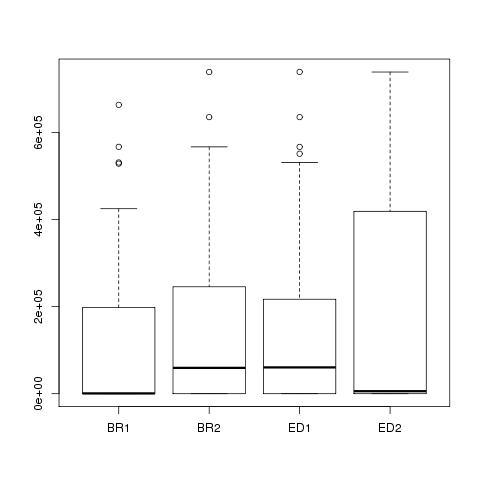
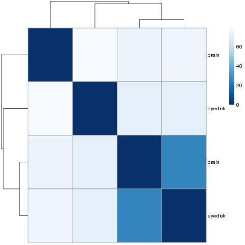
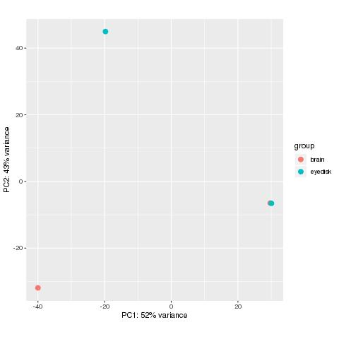

# EE283

The goal of the final project is to trick the DESeq2 packages to analyze ATAC data set on peaks instead of gene. Here is what I have found so far.

# note:

all generated files, images, and results are uploaded to this repo with their names as indicated in corresponding section in this readme. The result files/iumages name is listed at the end of their corresponding section as well. 

# file requirement:

Deseq2 requires 2 separated files. the first file is raw count of gene from samples (raw count of peak submit among all replicates in our case). The second files is a description files for all the sample with condition column can be change to a different classification system. Brain vs Eye disk vs wing disk etc. The two input files must be tab separated. 

# raw count example files (showing is only first 4 peaks. the sample file is called hwcount.txt contains 40 peaks): 

BR1     BR2     ED1     ED2
peak_1  1373    0       0       0
peak_2  2526    2530    2533    0
peak_3  10881   11026   11853   11496
peak_4  17342   0       0       0


For this file, the header need to contains only column name for all sample. The first column doesn't need a column name header. In fact, Deseq2 will not be happy and have error if there is 5 column header name vs only samples column name as shown. In addition, as this is only a test, peak name is labeled as 1,2,3 and so on; however, in reality, peak name can be the peak summit called by MACS2 on atac seq data and the number can be total occurence count of that summits among all replicates of Brain tissue or eye disk tissue. 

# column name input files (file name is hwcol.txt):

This file is description file for all sample column. shown below is the example used to test on deseq2 for the project. 

Sample  type    condition
BR1     ATAC    brain
BR2     ATAC    brain
ED1     ATAC    eyedisk
ED2     ATAC    eyedisk

For this file, it is typical column description files. There is one thing needs to be noted which is the requirements of the same samples description count vs all sample provided in raw count file. If the raw count file has 4 samples, the column description file must provided description for 4 samples. Other than that, header is a normal header for each column. 

# loading custom atac seq data file:

The data object names are kept the same as the tutorial for DESeq2 for the sake of simplicity. The thing to note here is that deseq2 can load in data from the two files mentioned above. As long as the files structures are kept constant. I reckon deseq2 can load in any count data for difference coverage be it peak, feature types, etc. and do analysis on it. Below shows the script to load in data from files to deseq2

```
Mnemiopsis_count_data = read.table(file = "hwcount.txt", header = T, sep = "\t")
Mnemiopsis_col_data = read.table(file = "hwcol.txt", header = T, sep = "\t")
dds = DESeqDataSetFromMatrix(countData=Mnemiopsis_count_data,colData = Mnemiopsis_col_data,design = ~ condition)
rld = rlogTransformation(dds)
```

# tested deseq2 function

After loading in data, I ran some simplot plot/analysis commands from deseq2 tutorial to see whether they works:

## boxplot of count distribution between samples.

```
jpeg("betweensampleboxplot.jpeg")
boxplot(Mnemiopsis_count_data)
dev.off()
```
this script works as intended in the tutorial. (note, the number from our sample file is not actual raw count so all created images don't have any analysis power).

Generated jpeg is betweensampleboxplot.jpeg



## rlog transformation:

DESeq2 offers transformations for count data that stabilize the variance across the mean: the regularized logarithm (rlog). This function works on our custome files too:

```
rld = rlogTransformation(dds)

jpeg("effectoftransformation.jpeg")
par( mfrow = c( 1, 2 ) )
plot(log2( 1 + counts(dds)[ , 1:2] ),pch=16, cex=0.3, main = "log2")
plot(assay(rld)[ , 1:2],pch=16, cex=0.3, main = "rlog")
dev.off()
```

generated jpeg is named effectoftransformation.jpeg


## clustering sample to sample distance: 

```
library("RColorBrewer") # Load a package giving more colors
library("pheatmap") # load a package for making heatmaps
distsRL <- dist(t(assay(rld))) # Calculate distances using transformed (and normalized) counts
mat <- as.matrix(distsRL) # convert to matrix
rownames(mat) <- colnames(mat) <- with(colData(dds), paste(condition)) # set rownames in the matrix
colnames(mat) = NULL # remove column names
colors <- colorRampPalette( rev(brewer.pal(9, "Blues")) )(255)

jpeg("sampletosampledistance.jpeg")
pheatmap(mat,clustering_distance_rows=distsRL,clustering_distance_cols=distsRL,col=colors)
dev.off()
```

This sample script also works without showing any error using our custom files.

generated jpeg is named sampletosampledistance.jpeg



## PCA plot

deseq2 also provide pca analysis using r log transformed count as follow.
```
jpeg("PCAplot.jpeg")
plotPCA(rld, intgroup=c("condition"))
dev.off()
```
As expected, these script also work on our custom files. 

generated jpeg is name PCAplot.jpeg




## differential analysis:
The last thing I atttempted to do is differential anaylysis:

```
dds = DESeq(dds)

res <- results(dds)
mcols(res, use.names=TRUE)
summary(res)
```

This also gives results from the analysis:

```
estimating size factors
estimating dispersions
gene-wise dispersion estimates
mean-dispersion relationship
-- note: fitType='parametric', but the dispersion trend was not well captured by the
   function: y = a/x + b, and a local regression fit was automatically substituted.
   specify fitType='local' or 'mean' to avoid this message next time.
final dispersion estimates
fitting model and testing
DataFrame with 6 rows and 2 columns
                       type                                        description
                <character>                                        <character>
baseMean       intermediate          mean of normalized counts for all samples
log2FoldChange      results log2 fold change (MLE): condition eyedisk vs brain
lfcSE               results         standard error: condition eyedisk vs brain
stat                results         Wald statistic: condition eyedisk vs brain
pvalue              results      Wald test p-value: condition eyedisk vs brain
padj                results                               BH adjusted p-values

out of 40 with nonzero total read count
adjusted p-value < 0.1
LFC > 0 (up)       : 7, 18%
LFC < 0 (down)     : 10, 25%
outliers [1]       : 0, 0%
low counts [2]     : 0, 0%
(mean count < 343)
```
the file result is named differentialanalysis.txt

# Future direction:

As expected and shown, the custom file can contains counts from any feature type (conditions) as long as the two input files for deseq2 retain their format. The next step of this project would be to generate actual data ( total count from all replicate for a peak and for a tissue,etc) to analyze with deseq2 and to compared with other known software which is used to analyze atacseq. 

# note:

all generated files, images, and results are uploaded to this repo with their names as indicated in corresponding section in this readme. The result files/iumages name is listed at the end of their corresponding section as well. 


# content of hw.r

```
#!/usr/bin/env Rscript

Mnemiopsis_count_data = read.table(file = "hwcount.txt", header = T, sep = "\t")
Mnemiopsis_col_data = read.table(file = "hwcol.txt", header = T, sep = "\t")

jpeg("betweensampleboxplot.jpeg")
boxplot(Mnemiopsis_count_data)
dev.off()

library(DESeq2)
dds = DESeqDataSetFromMatrix(countData=Mnemiopsis_count_data,colData = Mnemiopsis_col_data,design = ~ condition)

rld = rlogTransformation(dds)

jpeg("effectoftransformation.jpeg")
par( mfrow = c( 1, 2 ) )
plot(log2( 1 + counts(dds)[ , 1:2] ),pch=16, cex=0.3, main = "log2")
plot(assay(rld)[ , 1:2],pch=16, cex=0.3, main = "rlog")
dev.off()

library("RColorBrewer") # Load a package giving more colors
library("pheatmap") # load a package for making heatmaps
distsRL <- dist(t(assay(rld))) # Calculate distances using transformed (and normalized) counts
mat <- as.matrix(distsRL) # convert to matrix
rownames(mat) <- colnames(mat) <- with(colData(dds), paste(condition)) # set rownames in the matrix
colnames(mat) = NULL # remove column names
colors <- colorRampPalette( rev(brewer.pal(9, "Blues")) )(255)

jpeg("sampletosampledistance.jpeg")
pheatmap(mat,clustering_distance_rows=distsRL,clustering_distance_cols=distsRL,col=colors)
dev.off()


jpeg("PCAplot.jpeg")
plotPCA(rld, intgroup=c("condition"))
dev.off()


#differential analysis
dds = DESeq(dds)

res <- results(dds)
mcols(res, use.names=TRUE)
summary(res)

```


